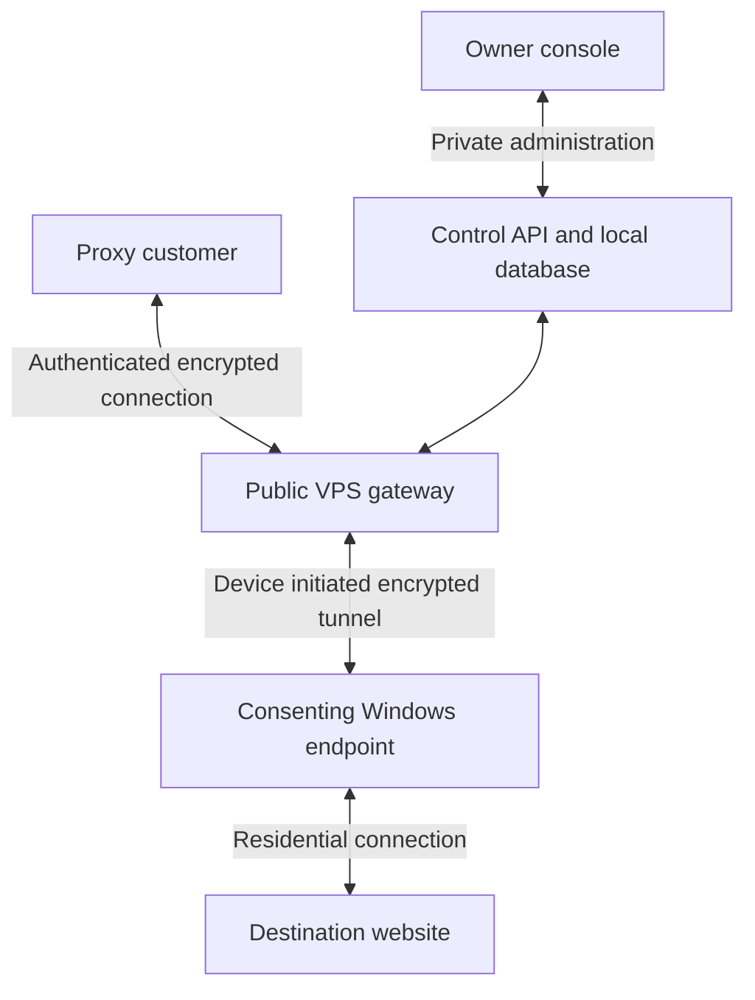

# Proxy Project

A residential proxy pilot with a shared SDK, a visible Windows participant app, and an authenticated TLS gateway.

The initial experiment has a **$100 spending cap** and a **30-day pilot schedule**. Its purpose is to validate customer demand, acquisition quality, endpoint availability, and operating margins before expanding.

**Status:** version 0.1.0 pilot implementation. The repository includes a working restricted SDK/gateway pair, automated tests, and a Windows installer build workflow. No VPS is deployed. Windows distribution requires a successful build, a real-machine smoke test, and code signing before paid rollout. Financial inputs remain hypotheses.

## Documentation

| Document | What it covers |
| --- | --- |
| [SDK and Windows installation](docs/sdk.md) | Implemented features, installation, gateway commands, protocol and limitations |
| [30-day pilot plan](docs/30-day-plan.md) | Budget, phased work, acquisition gates, measurement, and reinvestment |
| [Network architecture](docs/architecture.md) | VPS and SDK responsibilities, request flow, authentication, metering, and failure behavior |
| [VPS setup and device connections](docs/vps-setup.md) | Server preparation, ports, enrollment, tunnel protocol, deployment, and acceptance checks |
| [Architecture diagram](docs/assets/architecture.png) | Visual overview of the network and management connections |

The Markdown documents are the primary versions for ongoing repository edits. Original Word documents are retained as snapshots:

- [Original pilot plan](docs/originals/Residential_Proxy_30_Day_Plan.docx)
- [Original architecture document](docs/originals/Residential_Proxy_Architecture.docx)

Word snapshots are not automatically synchronized with future Markdown changes.

## Architecture overview

The endpoint initiates its connection to the gateway. Customers send requests through the gateway, and the endpoint opens the destination connection. Responses return through the same path. The destination sees the residential public IP.

The overview shows the target design. Version 0.1.0 uses a custom TLS Upgrade protocol, one stream per device, and local CLI administration; the owner console and WebSocket transport are not implemented. See [SDK documentation](docs/sdk.md).

For the pilot, the gateway, tunnel service, control API, and database share one VPS. These are logical roles, not four separately purchased servers. Participant devices generally do not require inbound port forwarding.

## Pilot budget

| Allocation | Maximum |
| --- | ---: |
| Acquisition batch A | $35 |
| Acquisition batch B, conditional on first-batch results | $35 |
| Gateway and operating costs | $20 |
| Contingency | $10 |
| **Total** | **$100** |

The operating budget is an allowance, not a VPS quote. Development labor and existing equipment are outside this experiment. See the [budget conditions](docs/30-day-plan.md#conditions-for-the-budget-to-work) before spending.

## First milestones

1. Choose one geography and obtain a real customer trial commitment.
2. Obtain acceptable install-source quotes and distribution terms.
3. Validate the visible Windows client, consent controls, gateway, quotas, and metering on authorized devices.
4. Run the first acquisition batch and measure same-age cohorts.
5. Release the second batch only after the stated quality review passes.
6. Reconcile paid usage, cash, and costs before deciding whether to continue.

The business review occurs on plan day 30. Devices acquired later in the month reach their own day-30 retention checkpoints afterward. Do not report immature cohorts as measured day-30 retention.

## Product requirements

- Explicit participation consent, visible status, pause, traffic caps, withdrawal, and uninstall.
- Separate customer, device, and administrative credentials.
- Authenticated routing, destination restrictions, quotas, and a global stop control.
- No access to participants' private networks or metadata endpoints.
- Minimal operational records and a defined deletion policy.
- No fabricated traffic or unearned prepayments counted as profit.

Implementation details and the rollout sequence are in the [architecture document](docs/architecture.md).

## Financial interpretation

Measure cost per usable retained endpoint, paid GB, variable contribution, and cash collected. Endpoint capacity alone does not create demand. Reinvest only collected profit after costs and required reserves; scale forecasts remain provisional until retention and repeat customer demand are demonstrated.

## Source and builds

| Path | Purpose |
| --- | --- |
| `proxy_sdk/` | Portable client, participant policy, framing and state |
| `apps/windows/main.py` | Visible consent and control UI |
| `gateway/` | TLS enrollment, device relay and customer CONNECT gateway |
| `tests/` | Unit and local TLS integration tests |
| `packaging/windows/` | Per-user Windows installer definition |
| `.github/workflows/test-and-build.yml` | Linux/Windows tests and Windows installer artifact |

Run `python -m unittest discover -s tests -v` with Python 3.12+ and OpenSSL. Follow [the installation guide](docs/sdk.md) for client builds and gateway startup.
