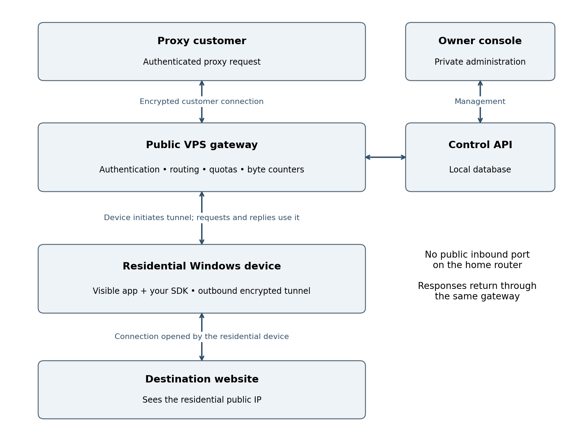

# Residential Proxy Network Pilot Architecture

Own SDK • Windows endpoints • One VPS • Prepared September 26 2026

Build the pilot around one public VPS gateway. Customers connect to the gateway; consenting residential devices connect outward to it. The gateway selects an available device, which opens the connection to the destination website. Your software owns this path end to end.

Solid arrows show two-way communication. The device initiates its tunnel even though customer requests later travel toward it. The database is local to the VPS for the pilot, not a separate public server.

The $20 gateway and operations allowance is a spending cap, not a supplier quote. This document defines the proposed design; no infrastructure has been deployed.

## Connections and request flow

### Device enrollment and availability

1. The participant installs the visible Windows app and explicitly accepts third-party traffic sharing. Record disclosure version, consent time, device identifier, and the participant’s controls. Participation remains off until consent is given.

2. Enroll the device using a one-time registration flow and issue a unique revocable device credential. Avoid a shared secret embedded in every distributed SDK. Store the credential using operating-system protection.

3. The SDK establishes an authenticated TLS connection to the gateway. It sends heartbeats and available capacity. The gateway records observed residential exit information and marks stale or disconnected devices unavailable.

4. The participant can pause, cap traffic, withdraw consent, or uninstall. Pause and withdrawal stop new assignments and close active proxy streams. Restart must preserve those choices.

### Customer request and response

1. A customer connects to the public gateway using a supported encrypted proxy transport and customer credential. For the pilot, support one documented HTTP CONNECT interface; defer SOCKS5 and additional transports.

2. The gateway checks the customer’s status, remaining quota, concurrency limit, permitted destination and port, and requested geography. It assigns an eligible connected device. If none is available, return an explicit failure rather than silently changing location.

3. The gateway sends a stream request through the device’s existing tunnel. The SDK validates the destination again, resolves it, rejects forbidden addresses, and connects to the permitted public destination.

4. Request and response bytes pass through the tunnel and gateway. Meter each logical customer stream, update quota reservations, and close both sides on timeout, cancellation, revocation, or a hard usage limit.

### Encryption boundaries

Customer-to-gateway encryption and device-to-gateway encryption protect those transport links. For an HTTPS CONNECT session, the customer’s TLS session with the destination can remain intact through the proxy. Do not install interception certificates or decrypt website sessions.

The gateway can still observe customer identity, requested destination, timing, and traffic volume. The residential device can observe the destination and its connection metadata. Do not describe the system as anonymous or as hiding all metadata.

### Network behavior

The destination sees the residential network’s public egress address, which may be shared through carrier-grade NAT. Several devices behind one household router do not create several unique public exits. Outbound tunnels generally avoid participant port forwarding, but restrictive networks may still prevent connection.

## Components and operating boundaries

| Component | Pilot responsibility | Placement |
| --- | --- | --- |
| Customer gateway | Proxy authentication, quotas, session routing and customer byte counts | Public VPS |
| Tunnel service | Device authentication, stream multiplexing, heartbeats and revocation | Same VPS |
| Control API | Enrollment, customer accounts, configuration and stop controls | Same VPS; restrict admin access |
| Database | Accounts, consent state, usage ledger and device status | Local persistent storage; no public database port |
| Windows app and SDK | Consent UI, tunnel, destination connection, caps, pause and uninstall | Participant device |
| Owner console | View health, costs, accounts, complaints and global stop | Owner browser over private access |

### Separate access and credentials

Customers may use their proxy credentials only for customer traffic. Device credentials may register and serve only their own tunnel. Administrative credentials must be separate and protected with strong authentication. Restrict administration using private network access or a tightly controlled access layer.

Expose only the required public gateway and enrollment/tunnel endpoints. Keep database access local. Logical services may share a VPS or process in the pilot; separate roles and authorization even when infrastructure is shared.

### Minimum controls before paid installs

Validate destinations at the gateway and again on the device immediately before connection. Block private, loopback, link-local, multicast, reserved and cloud-metadata addresses for both IPv4 and IPv6. Check every resolved address and prevent DNS rebinding. Prefer a destination allowlist for the initial customer trial.

Enforce per-customer and per-device bandwidth, concurrency, request and session limits. Rate-limit enrollment and authentication attempts. Bound buffers so a slow endpoint cannot consume unlimited gateway memory. Provide a global stop switch.

Keep operational metadata sufficient for billing and complaint handling without storing page bodies, passwords, or full sensitive URLs. Define retention and deletion periods before launch. Maintain encrypted backups of configuration and the usage ledger; test recovery.

### Failures and expected service limits

A single VPS is a single point of failure. If it fails, all routing stops. Devices reconnect with backoff; avoid simultaneous reconnect storms. Do not promise high availability during this pilot.

If a device sleeps or disconnects, its active sessions fail. Never transparently replay a non-idempotent customer request. Sticky sessions last only while that endpoint remains available. Clearly document pilot limits and customer retry responsibility.

## Metering costs and the first deployment

### Define one billable unit

Use decimal GB for the pilot: 1 GB equals 1,000,000,000 bytes. Bill the sum of customer request and response payload bytes crossing the logical proxy stream, counted once at the gateway. State whether failed-session payload counts; the pilot recommendation is to exclude traffic from failed connection setup.

Keep tunnel framing, TLS overhead, retries, heartbeats, and internal health checks outside customer billable bytes. Record them through infrastructure transfer counters because they still affect cost. Persist usage increments and reconcile them after interruptions so restart does not reset a customer’s balance.

### Why VPS transfer matters

For a mostly-download request returning 1 GB, the gateway receives roughly 1 GB from the device and sends roughly 1 GB to the customer, plus overhead. A provider counting both directions could record about 2 GB of transfer; a provider billing outbound only might charge about 1 GB. Requests, tunnel overhead, and retries add traffic.

The residential connection also receives the destination response and uploads it to your gateway. Participant bandwidth caps must cover the traffic definition shown in the app, not merely your customer’s billable counter.

| Budget item | Pilot limit | What to verify |
| --- | --- | --- |
| Gateway and operations | $20 | Server charge, included transfer, overages, disk and backup costs |
| Contingency | $10 | Necessary fees or operating surprises |
| Install batch A | $35 | Written distribution approval and a small deposit minimum |
| Install batch B | $35 | Release only after first-cohort quality review |

### Deployment sequence

First validate the client and gateway locally with authorized test devices. Next choose a VPS provider whose acceptable-use rules permit this proxy gateway and whose transfer terms fit the cap. Configure spending alerts, firewall rules, owner access, credentials, backups, and monitoring before connecting external participants.

Then run a small controlled customer trial. Observe CPU, memory, open sockets, bandwidth and queueing under the intended concurrency. Choose VPS sizing from those measurements; do not infer capacity from device count alone. Start acquisition only after pause, quotas, revocation, destination blocking and metering work.

### When to expand the architecture

Split the traffic gateway from the control API and database when measured load, reliability needs, or maintenance downtime justify it. Add gateways in regions supported by paying demand. Multiple gateways require shared quota coordination so customers cannot overspend across servers.

### Related plan and technical reference

This architecture supports [30-day pilot plan](30-day-plan.md). Financial rates and retention in that plan are assumptions requiring validation.

Microsoft Windows services overview: https://learn.microsoft.com/en-us/windows/win32/services/about-services
