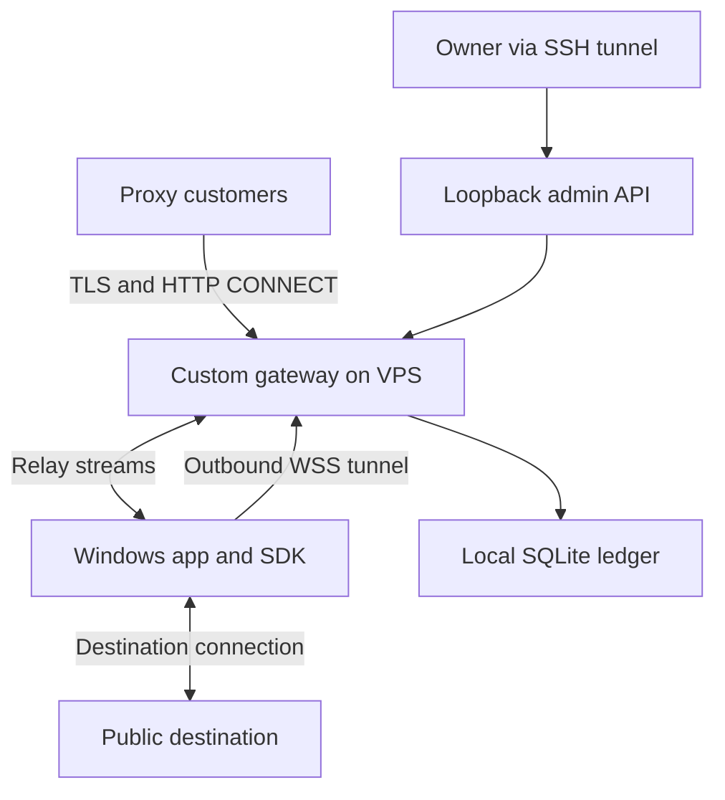

# VPS setup and device connection architecture

This guide defines the first deployment of your own residential proxy network: one Linux VPS, a custom gateway, and consenting Windows devices running your SDK. It extends the [network architecture](architecture.md) and [30-day plan](30-day-plan.md).

**Implementation update:** [Version 0.1.0](sdk.md) now provides a restricted gateway and Windows participant client. It uses custom TLS Upgrade framing instead of WebSockets, one stream per device, and local CLI administration instead of the proposed admin API. Follow its actual startup commands; the broader interfaces below remain a target design.

**Status:** deployment blueprint with a restricted pilot implementation. The broader API routes and protocol below are proposed interfaces; see [SDK setup](sdk.md) for what is implemented. No VPS has been provisioned. Commands marked as examples require the stated prerequisites.

## 1. Pilot deployment choice

Use one Ubuntu Server 24.04 LTS VPS with a public IPv4 address. A starting **test allocation** is 1–2 vCPUs, 2 GB RAM, and 20 GB SSD; it is not a validated capacity estimate. Check CPU, memory, sockets, latency, and transfer under the intended workload before promising concurrency.

Select a provider that permits your disclosed proxy gateway use case. Confirm included transfer, inbound versus outbound accounting, overage rates, billing minimums, and how to suspend service. Keep gateway and operating spending within the plan's $20 allowance plus its separate $10 contingency. If a domain, certificate delivery, or transfer requirement does not fit, revise the budget before buying installs.

For the first version:

- One custom gateway application handles device tunnels, customer proxy connections, and enrollment.
- SQLite on local persistent disk stores accounts, consent, device records, and the usage ledger.
- Live sockets and the available-device registry stay in memory.
- A separate loopback-only administrative listener provides owner controls.
- systemd supervises the application.
- A public DNS name and valid TLS certificate identify the gateway.

SQLite is a pilot choice, not a scaling guarantee. Serialize ledger writes, use transactions and bounded batching, and test write contention. Do not write every forwarded packet as a separate database transaction.

## 2. Service layout



Both public flows terminate at the custom gateway. The SDK opens the device tunnel; the VPS does not dial the household router. No participant router port forwarding, remote desktop, or remote shell is required.

The customer sends proxy requests to the VPS. The SDK opens the destination connection, so the destination sees the household's public egress IP. Replies pass through the SDK and gateway back to the customer.

### Proposed listeners

| Listener | Binding | Purpose |
| --- | --- | --- |
| Public gateway | TCP 443, public address | TLS; HTTP/1.1 CONNECT, device WebSocket upgrade, and enrollment |
| Certificate validation | TCP 80 only when needed | ACME HTTP validation; no credentials or proxy traffic |
| Administration | 127.0.0.1:9090 | Owner API and health/metrics through SSH forwarding |
| SSH | TCP 22, owner IP allowlist | Server administration |
| Database | Local file only | No public database listener |

Version one should deliberately support HTTP/1.1 over TLS. Implement method routing so CONNECT reaches the customer proxy handler while ordinary HTTPS paths and WebSocket upgrades reach their designated handlers. Do not advertise HTTP/2 until the server correctly handles its different CONNECT behavior.

Using one port requires a real custom HTTP server with CONNECT tunneling and WebSocket support. Installing a normal web reverse proxy does not create those features or the device-routing system.

An alternative is Caddy on TCP 443 for enrollment and device WebSockets, with a separate TLS listener for customer CONNECT. Caddy documents WebSocket reverse proxying, but that is not a drop-in implementation of this residential forward proxy. Use the single custom listener as the pilot target unless integration testing justifies the extra service.

## 3. Prepare the VPS

1. Create the server with your SSH public key and verify its host-key fingerprint using the provider console.
2. Create a non-root owner account with sudo access. Verify a second key-based login before changing SSH rules. Keep console recovery available.
3. Apply operating-system updates and reboot if required. Set up security updates and review their restart behavior.
4. Configure both the provider firewall and host firewall. Allow owner SSH before enabling deny-by-default inbound rules.
5. Create DNS records for a hostname you control, such as `gateway.your-domain.tld`, pointing to the VPS. Publish an AAAA record only if IPv6 listeners and firewall rules are correctly configured.
6. Obtain a publicly trusted TLS certificate through an ACME client. Select HTTP validation with a restricted port-80 challenge handler or DNS validation with narrowly scoped DNS credentials. Automate renewal and test certificate reload.
7. Install your versioned gateway build only after the local tests pass, using the commands in [SDK setup](sdk.md).

Example host firewall commands, after replacing the documentation address with your actual trusted owner address:

```bash
sudo ufw default deny incoming
sudo ufw default allow outgoing
sudo ufw allow from 203.0.113.10 to any port 22 proto tcp
sudo ufw allow 443/tcp
# Only if the chosen ACME HTTP validation flow requires port 80:
sudo ufw allow 80/tcp
sudo ufw enable
sudo ufw status verbose
```

`203.0.113.10` is an example, not a usable owner address. Ensure IPv6 is covered too. Do not close your existing SSH session until a new connection succeeds. Do not expose port 9090. These host rules do not replace the gateway's destination and customer controls.

The broad outbound rule permits normal DNS, updates, and operational traffic. Destination restrictions must also run on residential endpoints because their destination connections do not traverse the VPS host firewall.

## 4. Files and process identity

| Location | Contents and ownership |
| --- | --- |
| `/opt/proxy-project/releases/` | Versioned binaries; root-owned, not writable by the gateway |
| `/etc/proxy-project/` | Configuration and protected credentials; readable only as required |
| `/var/lib/proxy-project/` | SQLite database and application state; gateway service-owned |
| systemd journal | Bounded operational logs; credentials and payloads redacted |
| Separate backup destination | Encrypted application-consistent backups, outside the VPS |

Run under a dedicated unprivileged account, such as `proxygateway`. Grant only the capability needed to bind TCP 443, rather than running the whole service as root. Restrict writable paths to the application state directory.

Use systemd restart-on-failure with a delay and a restart limit. Evaluate `NoNewPrivileges`, `ProtectSystem`, and `ProtectHome` against the actual binary. File permissions must still allow TLS certificate reads and renewal reloads. Do not paste an invented service command into production: write the final unit after the gateway executable and flags exist.

Keep secrets out of Git, command-line arguments, URLs, and logs. Store device tokens securely on Windows and store only verification material on the server where practical. Use separate identities for customers, devices, and owners.

## 5. How machines join

### Proposed public routes

| Route or method | Authentication | Behavior to implement |
| --- | --- | --- |
| `POST /v1/devices/enroll` | One-time enrollment grant | Record consent, register device, issue a unique credential |
| `GET /v1/devices/tunnel` with WebSocket upgrade | Device credential | Establish the long-lived binary tunnel |
| HTTP CONNECT | Customer proxy credential | Validate customer and destination; reserve quota and select a device |

These paths are a proposed contract. They do not exist yet. A GET to the tunnel route without a valid upgrade must not enable forwarding.

Enrollment grants must be short-lived and single-use. For the pilot, issue them to verified participants through an owner-controlled process. Do not ship a reusable enrollment or administrative secret inside the SDK. Record the installed build, source attribution, disclosure version, consent time, and device identity.

After consent, the SDK:

1. Resolves the gateway hostname and verifies its TLS certificate.
2. Authenticates its outbound WebSocket using a device credential in a protected header.
3. Registers protocol version and allowed capacity.
4. Sends heartbeats and waits for permitted stream requests.
5. Reconnects with exponential backoff and jitter after network loss.

Proposed initial settings: heartbeat every 30 seconds, mark unavailable after 90 seconds without a valid heartbeat, and reconnect delay from 1 to 60 seconds. These are tuning defaults to test, not service guarantees.

On withdrawal, close active streams, revoke the credential, and stop reconnecting. Preserve the paused state across application and machine restarts.

## 6. Tunnel protocol and routing

A WebSocket connection is only a transport. Your SDK and gateway still need an agreed framing protocol.

| Message | Direction | Purpose |
| --- | --- | --- |
| HELLO | Device to gateway | Protocol version and capacity |
| OPEN | Gateway to device | Stream ID, hostname, port, deadline and policy |
| OPEN_OK or OPEN_ERROR | Device to gateway | Destination connection result |
| DATA | Both ways | Bytes associated with one stream |
| WINDOW_UPDATE | Both ways | Bound buffered bytes and apply backpressure |
| CLOSE | Both ways | Release stream and connection resources |
| HEARTBEAT | Both ways | Liveness |

Use bounded message sizes, bounded queues, unique active stream IDs, connection timeouts, and per-device concurrency limits. Multiplexing many streams over one TCP-backed tunnel can cause head-of-line blocking; measure it before raising concurrency.

Before sending OPEN, validate the customer, policy, quota, geography, device health, and capacity. Keep the route pinned for that active stream. Do not move a live TCP session to another device.

At the endpoint, validate the requested destination independently. Reject loopback, private, link-local, multicast, reserved, and metadata addresses in IPv4 and IPv6. Resolve the hostname, validate the selected address, and connect to that exact validated address to prevent a second DNS lookup from bypassing the check. Start the pilot with a small public destination allowlist.

Return CONNECT success only after OPEN_OK. On failure, return a documented proxy error; never silently fall back to direct VPS egress. If the endpoint disconnects mid-session, fail the session and let the customer decide whether to retry.

The SDK is a traffic relay. It must not accept remote shell commands, arbitrary file operations, or downloaded executable tasks over this protocol.

## 7. Usage and quotas

Count request plus response stream bytes once at the gateway, using the billing policy in the [architecture document](architecture.md#metering-costs-and-the-first-deployment). Track provider transfer separately.

Reserve quota before allowing traffic, with bounded per-stream credit windows. Reconcile actual usage transactionally. A crash must not reset balances or permit unlimited traffic while accounting is unavailable.

Pause new assignments when account credit, device caps, or the global spend limit is reached. A provider budget alert is not necessarily a hard spending cap: the application also needs a traffic stop control.

Log stream IDs, customer and device identifiers, byte counts, timing, and categorized errors. Do not log credentials, page bodies, or sensitive URL query strings. Define and enforce retention periods.

## 8. Owner access and monitoring

Bind the owner API to loopback and keep application authentication enabled even behind SSH forwarding. Example owner-side tunnel, after creating the owner account and replacing the hostname:

```bash
ssh -N -L 9090:127.0.0.1:9090 owner@gateway.your-domain.tld
```

Then access the admin UI at `http://127.0.0.1:9090`. Do not make it public for convenience.

Track connected devices, usable unique exits, endpoint-hours, active streams, connection success, latency, per-customer bytes, VPS transfer, CPU, memory, open file descriptors, disk free space, and certificate expiry. Alert on missing heartbeats, authentication spikes, quota failures, and cost limits.

Back up SQLite through an application-consistent method; do not copy only the database file while ignoring active WAL state. Encrypt backups, keep a copy outside the server, and test restoration with routing disabled before enabling customers.

## 9. Acceptance checks before buying installs

- [ ] Valid certificates on the public hostname; renewal and reload tested.
- [ ] Invalid customer and device credentials rejected; credentials cannot cross roles.
- [ ] A device behind a normal home router connects without port forwarding.
- [ ] An authorized test destination observes the household egress IP, not the VPS IP.
- [ ] Private destinations and DNS-rebinding attempts are blocked at the endpoint.
- [ ] Pause, withdrawal, uninstall, and device revocation stop routing.
- [ ] Customer and device caps stop traffic, including under concurrent streams.
- [ ] Gateway restart does not reset balances; unavailable accounting fails closed.
- [ ] Device sleep and connection loss fail sessions cleanly without replaying requests.
- [ ] Admin API and database are unreachable from the public internet.
- [ ] Usage counters reconcile with an independently measured controlled transfer.
- [ ] Backup restoration, global stop, and provider cost monitoring work.

Complete these with 3–5 authorized devices before the first $35 acquisition batch. Use synthetic tests for correctness and real paid customer traffic for economics; report them separately.

## 10. Deployment and rollback

Build and version the gateway and SDK together, with an explicit compatible protocol version. Deploy the server in maintenance mode, apply a backed-up database migration, run local health checks, and enable only test devices first.

Before an upgrade, stop new assignments and drain existing streams to a deadline. Disconnect remaining streams explicitly. Keep the previous binary, configuration, and a compatible database recovery plan. Roll back only to a version compatible with the current schema, or restore the planned backup while accounting for subsequent usage.

A single VPS remains a single point of failure. Add another gateway only after measured load or paying customers justify its cost and shared-quota coordination. This pilot does not promise uninterrupted sessions.

## References

- [Ubuntu Server firewall guide](https://documentation.ubuntu.com/server/how-to/security/firewalls/index.html)
- [Ubuntu UFW manual and IPv6 behavior](https://manpages.ubuntu.com/manpages/noble/man8/ufw.8.html)
- [Caddy reverse proxy and WebSocket support](https://caddyserver.com/docs/caddyfile/directives/reverse_proxy)
- [Caddy automatic HTTPS](https://caddyserver.com/docs/automatic-https)
- [systemd execution and service sandbox settings](https://github.com/systemd/systemd/blob/main/man/systemd.exec.xml)

Sources checked September 26 2026. Port assignments, protocol messages, sizing, and tuning values above are project design choices and require implementation testing.
